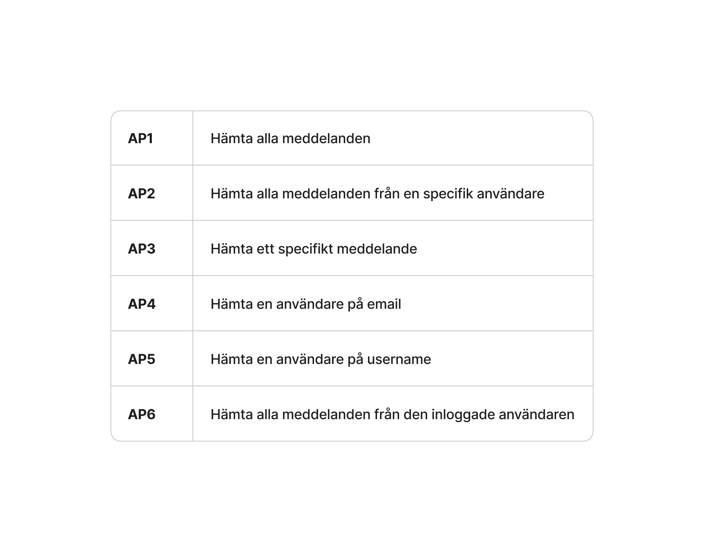
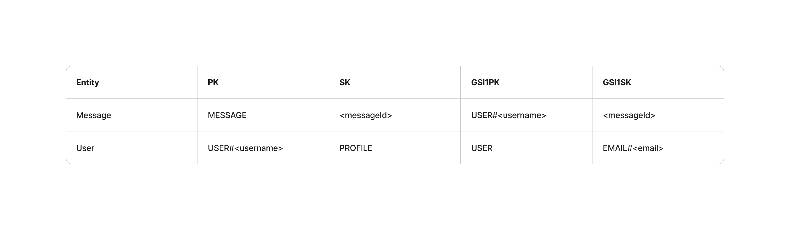

# Shui

Shui är en digital anslagstavla där användare kan skapa, läsa, redigera och ta bort meddelanden. Projektet består av en React-frontend och ett serverless API byggt med AWS Lambda, API Gateway och DynamoDB.

För VG-delen har jag även lagt till registrering, inloggning och JWT-baserad autentisering. Användare kan endast redigera och ta bort sina egna meddelanden.

## Deployad applikation

[Shui-applikationen](LÄGG-IN-DEPLOYAD-URL-HÄR)

## API

**Base URL:**

```text
https://hon3uvp5z2.execute-api.eu-north-1.amazonaws.com
```

API:t är byggt med Serverless Framework och använder AWS Lambda, API Gateway och DynamoDB.

---

# Endpoints

## Messages

### Hämta meddelanden

```text
GET /messages
```

Hämtar meddelanden. Om inget username anges hämtas alla meddelanden. Meddelandena sorteras från nyast till äldst.

**Request body:** Ingen

**Query parameter:**

```text
username
```

Query-parametern är valfri. Om den anges hämtas endast meddelanden från den användaren.

Exempel för att hämta alla meddelanden:

```text
GET /messages
```

Exempel för att hämta meddelanden från en specifik användare:

```text
GET /messages?username=konrad
```

**Response:**

```json
{
    "messages": [
        {
            "messageId": "abc12345",
            "userId": "8kah9",
            "username": "konrad",
            "text": "Hej!",
            "createdAt": "2026-09-24T10:00:00.000Z"
        }
    ]
}
```

---

### Hämta mina meddelanden

```text
GET /users/me/messages
```

Hämtar alla meddelanden från den inloggade användaren.

Endpointen kräver en giltig JWT-token.

**Request body:** Ingen

**Headers:**

```text
Authorization: Bearer <token>
```

**Path/query parameters:** Inga

**Response:**

```json
{
    "messages": [
        {
            "messageId": "abc12345",
            "userId": "8kah9",
            "username": "konrad",
            "text": "Hej!",
            "createdAt": "2026-09-24T10:00:00.000Z"
        }
    ]
}
```

---

### Hämta ett meddelande

```text
GET /messages/{messageId}
```

Hämtar ett specifikt meddelande.

**Request body:** Ingen

**Path parameter:**

```text
messageId
```

Exempel:

```text
GET /messages/abc12345
```

**Response:**

```json
{
    "message": {
        "messageId": "abc12345",
        "userId": "8kah9",
        "username": "konrad",
        "text": "Hej!",
        "createdAt": "2026-09-24T10:00:00.000Z"
    }
}
```

Om meddelandet inte finns returneras `404 Not Found`.

---

### Skapa ett meddelande

```text
POST /messages
```

Skapar ett nytt meddelande.

Endpointen kräver en giltig JWT-token. `userId` och `username` hämtas från den inloggade användarens JWT och skickas därför inte från frontend.

**Headers:**

```text
Content-Type: application/json
Authorization: Bearer <token>
```

**Request body:**

```json
{
    "text": "Mitt nya meddelande"
}
```

`text` måste innehålla minst ett tecken.

**Response:**

```json
{
    "message": "Message created",
    "newMessage": {
        "messageId": "abc12345",
        "userId": "8kah9",
        "username": "konrad",
        "text": "Mitt nya meddelande",
        "createdAt": "2026-09-24T10:00:00.000Z"
    }
}
```

`messageId` och `createdAt` skapas av backend.

---

### Uppdatera ett meddelande

```text
PUT /messages/{messageId}
```

Uppdaterar texten på ett meddelande.

Endpointen kräver en giltig JWT-token och användaren måste äga meddelandet.

**Headers:**

```text
Content-Type: application/json
Authorization: Bearer <token>
```

**Path parameter:**

```text
messageId
```

**Request body:**

```json
{
    "text": "Det uppdaterade meddelandet"
}
```

**Response:**

```json
{
    "message": "Message updated",
    "updatedMessage": {
        "messageId": "abc12345",
        "userId": "8kah9",
        "username": "konrad",
        "text": "Det uppdaterade meddelandet",
        "createdAt": "2026-09-24T10:00:00.000Z"
    }
}
```

---

### Ta bort ett meddelande

```text
DELETE /messages/{messageId}
```

Tar bort ett meddelande.

Endpointen kräver en giltig JWT-token och användaren måste äga meddelandet.

**Headers:**

```text
Authorization: Bearer <token>
```

**Path parameter:**

```text
messageId
```

**Response:**

Returnerar en bekräftelse på att meddelandet har tagits bort.

---

# Auth

## Registrera användare

```text
POST /auth/register
```

Skapar en ny användare.

Username och email måste vara unika. Lösenordet hashas innan användaren sparas i databasen.

**Headers:**

```text
Content-Type: application/json
```

**Request body:**

```json
{
    "username": "konrad",
    "email": "konrad@example.com",
    "password": "password123"
}
```

**Response:**

```json
{
    "message": "User registered successfully!"
}
```

Om username eller email redan används returneras `409 Conflict`.

---

## Logga in

```text
POST /auth/login
```

Loggar in en användare och returnerar en JWT-token.

**Headers:**

```text
Content-Type: application/json
```

**Request body:**

```json
{
    "email": "konrad@example.com",
    "password": "password123"
}
```

**Response:**

```json
{
    "message": "User logged in!",
    "token": "<jwt-token>"
}
```

Token används sedan i `Authorization`-headern på endpoints som kräver autentisering.

---

# DynamoDB

Projektet använder en DynamoDB-tabell som heter `shui-db`.

Tabellen använder en composite primary key:

```text
PK
SK
```

samt ett Global Secondary Index:

```text
GSI1PK
GSI1SK
```

Jag har utgått från projektets Access Patterns när jag designade tabellen och GSI:n.

## User

En användare lagras exempelvis så här:

```text
PK      = USER#konrad
SK      = PROFILE

GSI1PK  = USER
GSI1SK  = EMAIL#konrad@example.com

userId  = 8kah9
username = konrad
email   = konrad@example.com
password = <hash>
createdAt = <date>
```

Username används som partition key för användaren. Det gör att en användare kan hämtas direkt med sitt username.

GSI1 används för att kunna hitta en användare via email.

## Message

Ett meddelande lagras exempelvis så här:

```text
PK      = MESSAGE
SK      = abc12345

GSI1PK  = USER#konrad
GSI1SK  = abc12345

messageId = abc12345
userId    = 8kah9
username  = konrad
text      = Hej!
createdAt = <date>
```

Alla meddelanden har `PK = MESSAGE`, vilket gör att alla meddelanden kan hämtas med en Query mot tabellen.

GSI1 används för att kunna hämta alla meddelanden från ett specifikt username.

## Access Patterns

Mina Access Patterns och databasdesignen visas i bilderna nedan.

### Access Patterns



### DynamoDB-design



---

# Lokal utveckling

## Frontend

Installera projektets dependencies:

```bash
npm install
```

Starta utvecklingsservern:

```bash
npm run dev
```

Frontend körs därefter lokalt med den URL som Vite visar i terminalen.

## Backend

Gå till backend-projektet:

```bash
cd shui-backend
```

Installera dependencies:

```bash
npm install
```

Backendens environment-variabler behöver vara konfigurerade, bland annat:

```text
JWT_SECRET
```

AWS credentials och IAM-konfiguration behöver också vara tillgängliga för att API:t ska kunna kommunicera med AWS.

API:t deployas med Serverless Framework:

```bash
npx serverless deploy
```

Efter deployment används den deployade API Base URL:en för frontendens API-anrop.
